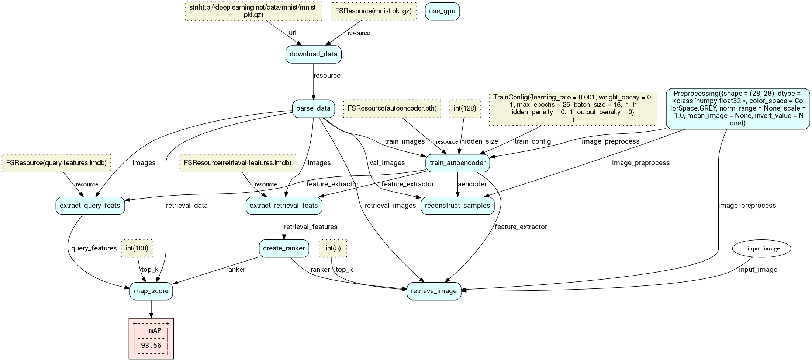

# RFlow - A workflow framework for end-to-end research

## Introduction

The Rflow (or Research Flow) project is Python framework for creating
Directed Acyclic Graph (DAG) workflows. Our goal is to aid developers
in developing end-to-end stages of data preprocessing, model fitting
and evaluation with less boilerplate code. Making reproducible
research easier for the Information Retrieval and Machine Learning
communities.

The image below shows the graph visualization of a [MNIST autoencoder
retrieval
experiment](https://gitlab.com/shrkit/shape-retrieval-toolkit/tree/master/experiments/mnist). Rflow
managed the connections of user's code, from dataset parsing to
autoencoder training, evaluation, and empirical test.



For example, the training node is defined as in the following snippets:

```python
class TrainFeatureExtractor(rflow.Interface):

    def non_collateral(self):
        # Using GPU or not doesn't change final training.
        return ["use_gpu"] 

    # Rflow stores every argument not listed in non_collateral().
	# So it knows when arguments are changed, executing nodes and its dependencies when needed.
	
    def evaluate(self, resource, train_images, hidden_size,
                 train_config, image_preprocess, show_debug=False,
                 use_gpu=False):
        # Training using PyTorch, Tensorflow, ...		 
        return <trained model>

# Define other Interfaces

@rflow.graph()
def mnist(g):

    # Create other nodes ...
	
    # Sample user argument from command line
    g.use_gpu = rflow.UserArgument(
        '--use-gpu', action='store_true',
        help="Whatever to use GPU")

    # Create other nodes ...
	
    g.train_autoencoder = TrainFeatureExtractor(
        rflow.FSResource('autoencoder.pth')) # FSResource is the node's reentrant checkpoint file.
    with g.train_autoencoder as args:
        args.train_images = train_data
        args.hidden_size = 128
        args.train_config = autoencoder.TrainConfig(
            25, 16, 0, 0, 0.001, 0.1)
        args.image_preprocess = g.preprocessing
        args.use_gpu = g.use_gpu

```

More information:

* [Tutorial](https://otaviog.gitlab.io/rflow/wordcounter/tutorial.html)
* [Reference
  documentation](https://otaviog.gitlab.io/rflow)
* [Sample MNIST character
  retrieval](https://gitlab.com/shrkit/shape-retrieval-toolkit/tree/master/experiments/mnist)
* [Spectral descriptors 3D shape retrieval
  experiments](https://gitlab.com/shrkit/spectral-retrieval)  
* [Multiview 3D shape retrieval
  experiments](https://gitlab.com/shrkit/multiview-dnn)

This project is under development, but should be usable for small
projects.

## Getting Started

Currently, shrkit is only available on Linux systems and requires
Python 3. The required environment packages (Ubuntu):

```shell
$ sudo apt install git python3-venv python3-pip graphviz
```

Grab using pip:

```shell
$ pip install git+https://github.com/otaviog/rflow
```

For development setup, please refer to the [CONTRIBUTING
guide](CONTRIBUTING.md).

Create your first workflow:

```python
import rflow

class CreateMessage(rflow.Interface):
    def evaluate(self, msg):
        return msg

class Print(rflow.Interface):
    def evaluate(self, msg):
        print(msg)

@rflow.graph()
def hello(g):
    g.create = CreateMessage()
    g.create.args.msg = "Hello"

    g.print = Print()
    g.print.args.msg = g.create

if __name__ == '__main__':
    rflow.command.main()
```

Save it as workflow.py and run with `rflow` command:

```shell
$ rflow hello run print
UPDATE  hello:print
.UPDATE  hello:create
.RUN  hello:create
.^hello:create
RUN  hello:print
Hello
^hello:print
```

Use the command `viz-dag` to visualizate the DAG:

```shell
$ rflow hello viz-dag
```


## Similar Projects 

* [Luigi](https://github.com/spotify/luigi) - Spotify's workflow tool.
* [Airflow](https://airflow.apache.org/) - Apache's workflow tool.
* [Weka](http://www.cs.waikato.ac.nz/ml/weka/) - Machine learning workflow and toolkit.
* [Microsoft Asure for Machine Learning](https://studio.azureml.net) -
  A GUI workflow for machine learning pipelines.
